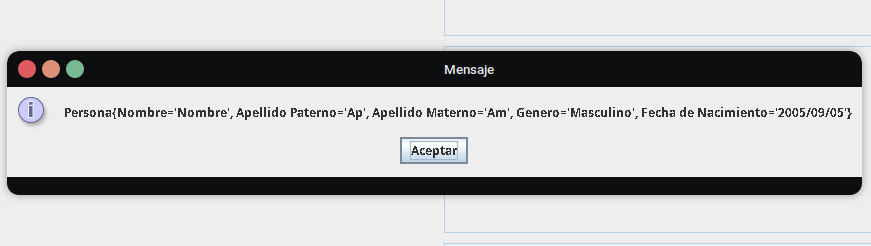

# CURP Extractor con Interfaz Gráfica en Java 🧾🇲🇽

Esta aplicación permite al usuario ingresar un CURP (Clave Única de Registro de Población) y automáticamente extrae datos importantes como:

- Fecha de nacimiento 🗓️
- Género 👤
- Estado de nacimiento 🗺️
- Y además, crea un objeto `Persona` a partir de estos datos.

Todo esto se muestra en una interfaz gráfica sencilla construida con **Swing**.

---

## 💻 ¿Qué hace la aplicación?

1. Muestra una ventana con campos para ingresar un CURP.
2. Al hacer clic en el botón **Siguiente**:
   - Valida que el CURP tenga al menos 18 caracteres.
   - Extrae:
     - Fecha de nacimiento
     - Género (masculino/femenino)
     - Estado de nacimiento (ej. Nuevo León)
   - Llena automáticamente los campos correspondientes en pantalla.
   - Crea una instancia de la clase `Persona` con los datos obtenidos.
   - Muestra el contenido del objeto `Persona`.

---

## 📦 Estructura del proyecto

### 🔹 Clase `Ventana.java`

Contiene todo el código de la interfaz gráfica y la lógica de procesamiento del CURP.

#### Componentes:
- `JTextField curpCampo`: Campo donde el usuario introduce el CURP.
- `JTextField fechaNacimientoCampo`: Se llena automáticamente con la fecha de nacimiento.
- `JTextField generoCampo`: Se llena automáticamente con el género.
- `JTextField estadoField`: Se llena automáticamente con el estado.
- `JButton btnSiguiente`: Al hacer clic, procesa el CURP.

#### Lógica en el botón `Siguiente`:

```java
String curp = curpCampo.getText().toUpperCase().trim();
```
Convierte el texto a mayúsculas y elimina espacios.

```java
String año = curp.substring(4, 6);
String mes = curp.substring(6, 8);
String dia = curp.substring(8, 10);
```
Extrae la fecha de nacimiento desde el CURP.

```java
String siglo = (anioInt < 30) ? "20" : "19";
```
Determina si es del siglo 1900 o 2000 según el año.

```java
char generoChar = curp.charAt(10);
```
Extrae el carácter que representa el género: `'H'` o `'M'`.

```java
String estadoCodigo = curp.substring(11, 13);
String estadoNombre = obtenerNombreEstado(estadoCodigo);
```
Obtiene las letras del estado y las convierte en su nombre completo.

```java
Persona persona = new Persona("Desconocido", "Desconocido", "Desconocido", generoTexto, fechaFormateada);
```
Crea una instancia de la clase `Persona` usando los datos extraídos.

---

### 🔹 Clase `Persona.java`

Es una clase POJO (Plain Old Java Object) que representa una persona con los siguientes atributos:

```java
String nombre;
String apellidoPaterno;
String apellidoMaterno;
String genero;
String fechaNacimiento;
```

Incluye:
- Constructor con todos los campos.
- Métodos `get` y `set` para cada campo.
- Método `toString()` para mostrar los datos en forma legible.

Ejemplo de salida de `toString()`:
```text
Persona{apellidoMaterno='Desconocido', nombre='Desconocido', apellidoPaterno='Desconocido', genero='Femenino', fechaNacimiento='2004-01-23'}
```

---

## 📚 ¿Qué aprendiste con este proyecto?

- Cómo manipular cadenas de texto (`substring`, `charAt`) para extraer datos.
- Cómo construir una interfaz gráfica con **Swing** (`JFrame`, `JTextField`, `JButton`, etc).
- Cómo manejar errores con `try-catch`.
- Cómo usar la clase `Objects` y su método `requireNonNullElse()` para asignar valores por defecto.
- Cómo crear y usar clases orientadas a objetos como `Persona`.

---

## ✨ Posibles mejoras futuras

- Validar el formato del CURP con una expresión regular (regex)
- Permitir al usuario ingresar nombre y apellidos en la interfaz
- Guardar las personas en un archivo o base de datos
- Mostrar resultados en una nueva ventana o tabla

---

🏁 Ejemplo de Ejecucion

---


---



## 🧑‍💻 Autor

Desarrollado por Said Nazario Corona
